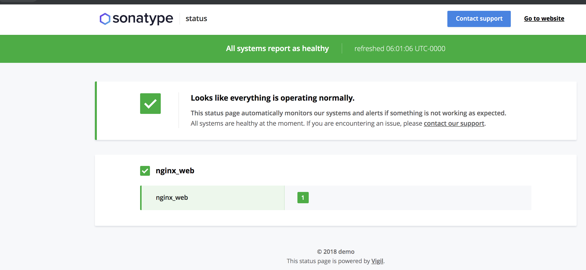
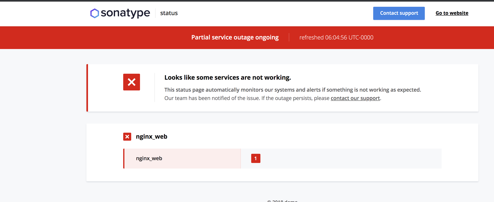

# 使用状态文件+vigil 监控系统状态

## 原理

通过任务检测服务状态，并回写数据到文件，通过匹配nginx提供的静态文件内容
确定服务的状态

## 使用方法

* 本地创建一个具有唯一标示的文件

```code
为了简单使用 uuid 别名，比如53c2e115-da65-47fd-8e6c-13bb95d3f2c6
```

* 创建nginx location

```code
使用了精准匹配

location =/53c2e115-da65-47fd-8e6c-13bb95d3f2c6 {
            root /opt;
            default_type text/plain;
}

```

* 约定内容匹配规则

```code
比如如果内容为ok 就是健康，其他就是异常
```

* vigil 添加probe 信息

```code
# Vigil
# Microservices Status Page
# Configuration file
# Example: https://github.com/valeriansaliou/vigil/blob/master/config.cfg


[server]

log_level = "error"
inet = "0.0.0.0:9090"
workers = 4
reporter_token = "appkey"

[assets]

path = "./res/assets/"

[branding]

page_title = "服务监控状态"
page_url = "https://www.badi.com/"
company_name = "demo"
icon_color = "#3C82E7"
icon_url = "https://help.sonatype.com/repomanager3/_/7F0000010161B31F409A4915783C449A/1555428150908/assets/img/SON_logo_main_small@2x.png"
logo_color = "#3C82E7"
logo_url = "https://help.sonatype.com/repomanager3/_/7F0000010161B31F409A4915783C449A/1555428150908/assets/img/SON_logo_main_small@2x.png"
website_url = "https://www.badi.com"
support_url = "mailto:1141591465@qq.com"
custom_html = ""

[metrics]

poll_interval = 20
poll_retry = 2

poll_http_status_healthy_above = 200
poll_http_status_healthy_below = 400

poll_delay_dead = 20
poll_delay_sick = 10

push_delay_dead = 20

push_system_cpu_sick_above = 0.90
push_system_ram_sick_above = 0.90

[notify]
reminder_interval = 300

[notify.email]

from = "notify-email@email.com"
to = "to email user"
smtp_host = "smtp server"
smtp_port = 587
smtp_username = "emailaccount"
smtp_password = "accountpassword"
smtp_encrypt = true

[probe]
 
[[probe.service]]

id = "nginx_web"
label = "nginx_web"

[[probe.service.node]]

id = "nginx_web"
label = "nginx_web"
mode = "poll"

replicas = ["http://web:8080/53c2e115-da65-47fd-8e6c-13bb95d3f2c6"]

// 内容匹配处理
http_body_healthy_match ="ok"


```

## 测试

* 启动服务

```code
docker-compose up -d
```

效果



* 修改内容

```code
error
```

效果


